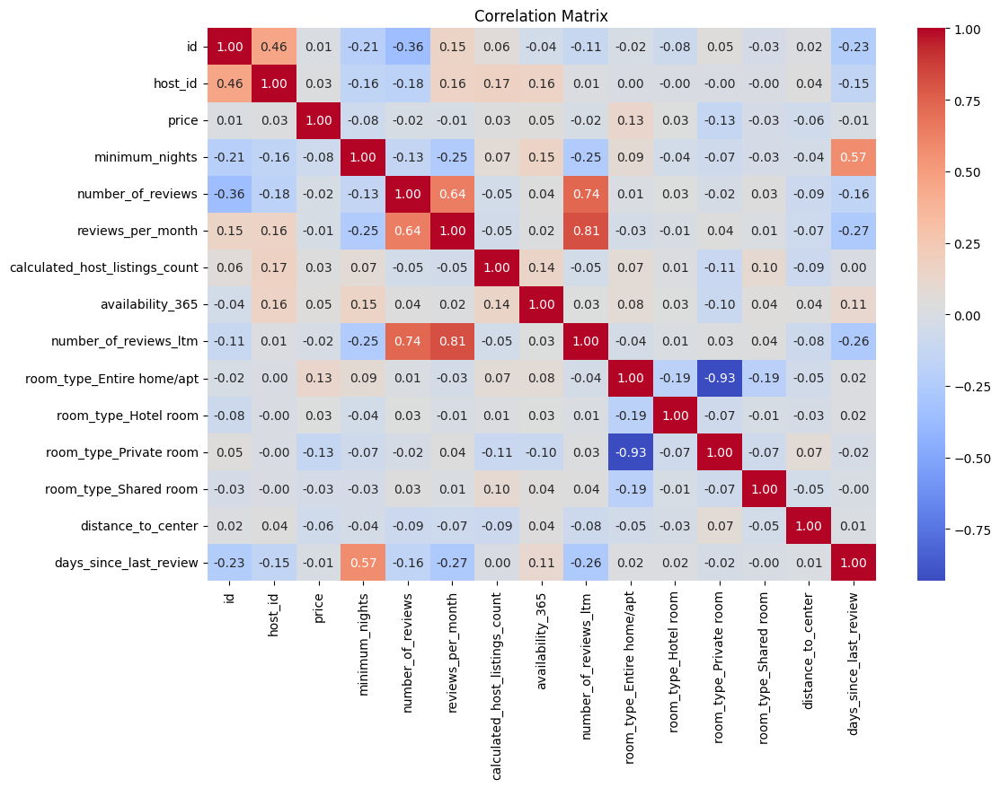
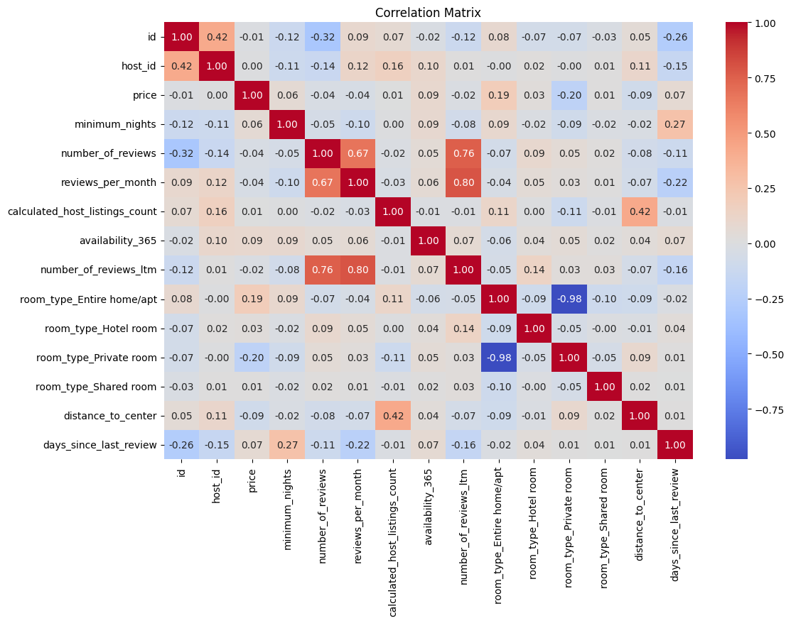
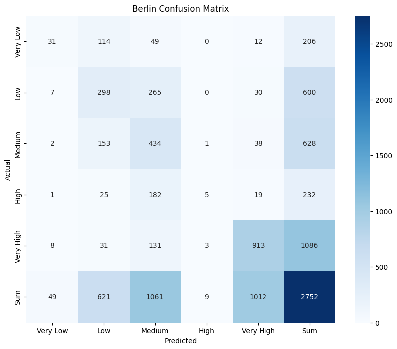
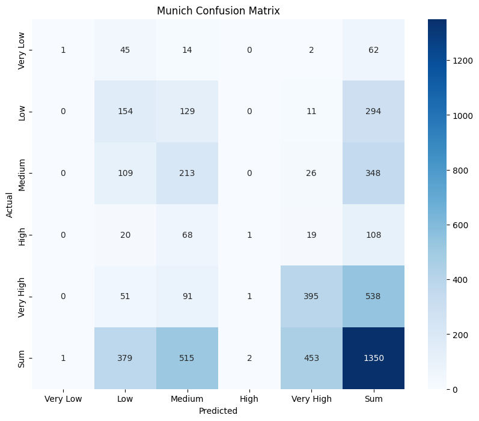
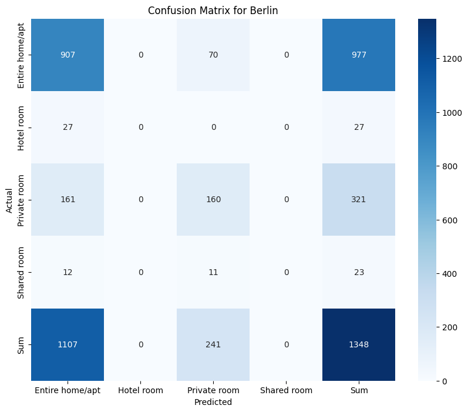
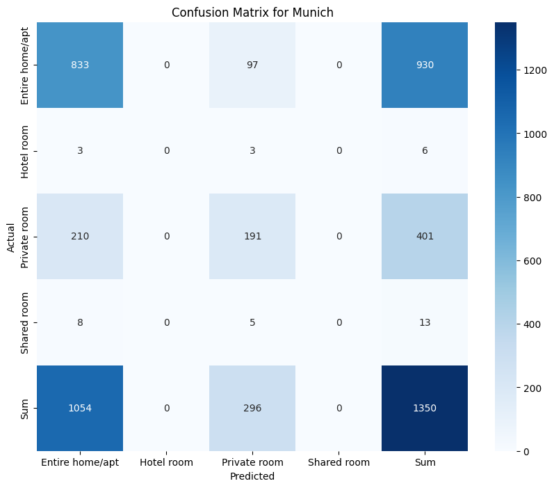

# Airbnb Berlin & Munich Price Modeling

How well can an Airbnb listing's price in Berlin and Munich be predicted from its
location, availability and review history alone — and does the same model work
equally well in both cities?

## Findings

- **Berlin is more predictable than Munich, on every model tried.** XGBoost
  regression scored 65.71% on Berlin against 56.51% on Munich; Random Forest
  price-bracket classification 61.1% against 56.6%; KNN room-type classification
  79.2% against 75.9%. The gap holds across three unrelated model families, so it
  is a property of the data rather than of one model.
- **Price is only weakly predictable from these features.** The best regression
  run left roughly a third of Berlin's price and nearly half of Munich's
  unexplained, and the 5-class price-bracket classifier beat a naive guess by a
  modest margin. The notebook attributes this to weak correlations between price
  and the available numeric features — visible in the correlation matrices below.
- **Room type is much easier to predict than price.** The KNN room-type
  classifier reached 79.2% (Berlin) and 75.9% (Munich), well above either price
  model. Note this model is given `price` as an input feature, so it is not a
  like-for-like comparison with the two price tasks.
- **Distance from the centre does not explain availability.** A listing near the
  centre is not systematically booked more of the year. The one visible pattern
  is that "Very High" priced listings show lower availability than other price
  brackets.

### How to read the regression number

"65.71%" is not classification accuracy. It is `(1 - MAPE) × 100` on the held-out
test set, where MAPE is the mean absolute percentage error of the predicted
price. The model is trained on `log1p(price)` and predictions are inverted with
`expm1` before scoring. The 5-fold cross-validation figures in the notebook are
negative MAPE on the training split: Berlin −0.071 to −0.075, Munich −0.076 to
−0.085.

## What this was for

The question is whether a host or a market analyst can estimate a fair nightly
price from public listing attributes, and whether a model fitted in one city
transfers to another. Anyone pricing a new listing, or a platform flagging
mispriced inventory, would care about the answer — and about the finding that the
answer is city-specific.

## Figures

| | |
|---|---|
|  |  |
| Feature correlations, Berlin | Feature correlations, Munich |
|  |  |
| Price-bracket confusion matrix, Berlin | Price-bracket confusion matrix, Munich |
|  |  |
| Room-type confusion matrix, Berlin | Room-type confusion matrix, Munich |

All figures are the outputs committed in `Airbnb.ipynb`.

## Models

| Task | Model | Berlin | Munich |
|---|---|---|---|
| Price (continuous) | XGBoost regression on `log1p(price)`, tuned with RandomizedSearchCV (10 candidates × 3 folds) | 65.71% | 56.51% |
| Price bracket (5 classes) | RandomForestClassifier, 100 trees, max_depth 10 | 0.611 | 0.566 |
| Room type | KNeighborsClassifier (k=10 Berlin, k=20 Munich) | 0.792 | 0.759 |

Price brackets are Very Low (≤50), Low (≤100), Medium (≤200), High (≤300), Very
High (>300). All scores are on a held-out 20% test split, `random_state=42`.
Distance to centre is computed with the Haversine formula.

## Tech stack

Python, pandas, numpy, scikit-learn, xgboost, scipy, matplotlib, seaborn, Jupyter.

## How to run

The repository is a single notebook, `Airbnb.ipynb`, written in Google Colab.

```bash
pip install pandas numpy scikit-learn xgboost scipy matplotlib seaborn jupyter
jupyter notebook Airbnb.ipynb
```

The first cell uses `google.colab.files.upload()` to take two CSVs,
`berlin_airbnb.csv` and `munich_airbnb.csv`. Running outside Colab means
replacing that cell with a direct `pd.read_csv()` of the two files. The CSVs are
not committed — download them from the source below.

## Data sources

Quarterly listings data for Berlin, Germany and Munich, Bavaria, Germany from
[Inside Airbnb](https://insideairbnb.com/get-the-data/), covering the 12 months
before the analysis. Roughly 18 usable columns per listing; rows with missing
values are dropped, and `neighbourhood_group`, `license`, `neighbourhood`,
`host_name` and `name` are removed before modelling.

## Motivation & limitations

The project originally targeted Finnish real estate through the Oikotie API. The
site was updated and the existing API could no longer be used, so the work moved
to Inside Airbnb data for Berlin and Munich, which offered a comparable set of
structured features across two cities.

Known limitations, all visible in the notebook:

- `availability_365` is listed twice in the feature sets for both classification
  models, so one column is duplicated rather than adding information.
- The room-type classifier uses `price` as a predictor, which is why its accuracy
  is not comparable to the price models.
- Berlin drops rows with missing values while Munich mean-imputes them, so the
  two cities are not preprocessed identically. This was a deliberate choice to
  try both approaches, and it is one more reason to be careful comparing the two.

## Authors

Anastasiia Kosareva and Luis Rheinert.
